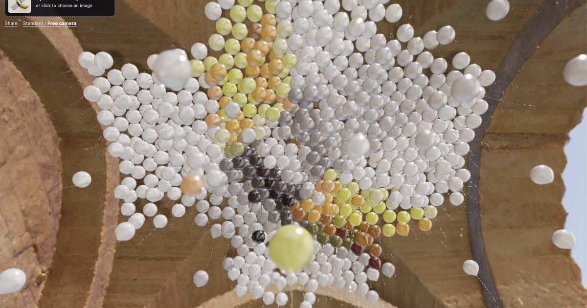

# Balloon Art

Turn a photo into a ceiling of colorful balloons. Choose an image and watch the balloons rise into place to reveal it.

**Live site:** [daveseidman.github.io/balloon-art](https://daveseidman.github.io/balloon-art/)



## How it works

- Your image is center-cropped to a square and resampled to a 32 × 32 grid. Each sample is mapped to a fixed 256-color palette and assigned to a balloon.
- The browser computes the balloon motion in a Web Worker, then plays the show at normal speed. The worker lets image preparation happen without rendering the full simulation to the screen first.
- Once the balloons settle, you can push them with the mouse. They gradually return toward their image positions.
- Share links encode the sampled colors and a random seed in the URL. The image itself is not uploaded or stored on a server. Shared links use the app's default simulation settings.
- The app includes standard and free camera modes, live reflections, depth of field, and rendering controls. Press **F1** to show or hide the controls.

## Run locally

Requires Node.js and npm.

```sh
npm install
npm run dev
```

Create and preview a production build with:

```sh
npm run build
npm run preview
```

## Deploy

The GitHub Actions workflow in `.github/workflows/pages.yml` builds and deploys the `main` branch to GitHub Pages. The Vite build uses `/balloon-art/` as its base path for Pages. The 3D model and Venice sunset HDRI are included in the repository so the scene can run without fetching those assets from a remote host.

## Built with

React, Vite, Three.js, React Three Fiber, and Rapier.
